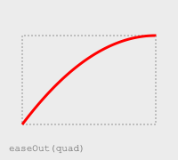
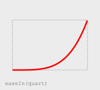
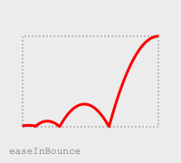
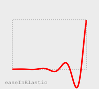

# Easing Functions (Easie)


A collection of cross-platform easing functions written in Swift with no dependencies on SwiftUI or CoreGraphics.

## Simple example

```swift
// An ease-out curve
let unitCurve = EaseOutInEaseOut()
let unitY = unitCurve.value(at: 0.88)
```

## Easing Types

| Type      |  `EaseIn`  |  `EaseOut`  |  `EaseInEaseOut`  | 
|-----------|------------|-------------|-------------------|
| `sine`    |  |  |  | 
| `cubic`   |  |  |  |	
| `quint`   |  |  |  |
| `circ`    |  |  |  |
| `quad`    |  |  |  |
| `quart`   |  |  |  |
| `expo`    |  |  |  |	
| `bounce`  |  |  |  |
| `back`    |  |  |  |
| `elastic` |  |  |  |

### Examples

```swift
// An ease-out curve
let unitCurve = EaseOut(.cubic)
let unitY = unitCurve.value(at: 0.25)
```

```swift
// An ease-in-ease-out elastic curve
let unitY = easeInEaseOutElastic(at: 0.68)
```

## Cubic Types

A Cubic bezier curve with the first point `P0` as (0.0, 0.0) and last point `P3` as (1.0, 1.0). 

A cubic Bézier curve is defined by four points: P0, P1, P2, and P3. The points P0 and P3 represent the start and the end of the curve


Cubic Bézier curves with the P1 or P2 coordinate outside the [0, 1] range can cause the value to go farther than the
final state and then return.


```swift
let unitCurve = CubicBezierCurve(x1: 0.1, y1: 0.6, x2: 0.7, y2: 0.2)
let unitY = unitCurve.value(at: 0.25)
```

## Linear Types

Linear curves define the `Y` values equally spaced along the t axis.

A linear curve must always start at 0.0 and end at 1.0.


### Examples

```swift
let linear = Linear(values: [0.0, 0.25, 0.25, 1.0])
let unitY = linear.value(at: 0.25)
```

```swift
// An linear curve
let linear = Linear(values: [0.0, 0.1, 0.5, 0.9, 1.0])
let unitY = linear.value(at: 0.68)
```

## Jump (step) Types

Jump curves define step function(s) that divides the domain of output values in equidistant steps

| Type        | Image                                               | Description |
|-------------|-----------------------------------------------------|-------------|
| `jumpStart` |   | Jump up to the first step at the t=0.0 point, with the final step at t=1.0 | 
| `jumpEnd`   |     | Jump up to the first step at the end of the first step |
| `jumpNone`  |    | Jump up to the first step at the end of the first step, with the final step at 1.0 | 
| `jumpBoth`  |    | Jump up to the first step at t=0 with the final step at 1.0 |

### Examples

```swift
let jump = Jump(.jumpEnd, steps: 4)
let unitY = jump.value(at: 0.25)
```

```swift
let jump = Jump(.jumpBoth, steps: 3)
let unitY = jump.value(at: 0.68)
```

## References

* [Robert Penner](http://robertpenner.com/easing/) [archived](https://web.archive.org/web/20241108204417/http://robertpenner.com/easing)
* [Nic Mulvaney](https://nicmulvaney.com/easing) [archived](https://web.archive.org/web/20240926061450/https://nicmulvaney.com/easing)
* [Steps easing functions @ Mozilla](https://developer.mozilla.org/en-US/docs/Web/CSS/easing-function#steps_easing_function)
* [Cubic Bézier easing functions @ Mozilla](https://developer.mozilla.org/en-US/docs/Web/CSS/easing-function#cubic_bézier_easing_function)

## License

```
MIT License

Copyright (c) 2024 Darren Ford

Permission is hereby granted, free of charge, to any person obtaining a copy
of this software and associated documentation files (the "Software"), to deal
in the Software without restriction, including without limitation the rights
to use, copy, modify, merge, publish, distribute, sublicense, and/or sell
copies of the Software, and to permit persons to whom the Software is
furnished to do so, subject to the following conditions:

The above copyright notice and this permission notice shall be included in all
copies or substantial portions of the Software.

THE SOFTWARE IS PROVIDED "AS IS", WITHOUT WARRANTY OF ANY KIND, EXPRESS OR
IMPLIED, INCLUDING BUT NOT LIMITED TO THE WARRANTIES OF MERCHANTABILITY,
FITNESS FOR A PARTICULAR PURPOSE AND NONINFRINGEMENT. IN NO EVENT SHALL THE
AUTHORS OR COPYRIGHT HOLDERS BE LIABLE FOR ANY CLAIM, DAMAGES OR OTHER
LIABILITY, WHETHER IN AN ACTION OF CONTRACT, TORT OR OTHERWISE, ARISING FROM,
OUT OF OR IN CONNECTION WITH THE SOFTWARE OR THE USE OR OTHER DEALINGS IN THE
SOFTWARE.
```

## Robert Penner MIT license

[Easing terms of use](http://robertpenner.com/easing_terms_of_use.html) ([archive.org](https://web.archive.org/web/20240915222613/http://www.robertpenner.com/easing_terms_of_use.html))

```
MIT License

Copyright © 2001 Robert Penner

Permission is hereby granted, free of charge, to any person obtaining a copy
of this software and associated documentation files (the "Software"), to deal
in the Software without restriction, including without limitation the rights
to use, copy, modify, merge, publish, distribute, sublicense, and/or sell 
copies of the Software, and to permit persons to whom the Software is
furnished to do so, subject to the following conditions:

The above copyright notice and this permission notice shall be included in all 
copies or substantial portions of the Software.

THE SOFTWARE IS PROVIDED "AS IS", WITHOUT WARRANTY OF ANY KIND, EXPRESS OR
IMPLIED, INCLUDING BUT NOT LIMITED TO THE WARRANTIES OF MERCHANTABILITY,
FITNESS FOR A PARTICULAR PURPOSE AND NONINFRINGEMENT. IN NO EVENT SHALL THE
AUTHORS OR COPYRIGHT HOLDERS BE LIABLE FOR ANY CLAIM, DAMAGES OR OTHER
LIABILITY, WHETHER IN AN ACTION OF CONTRACT, TORT OR OTHERWISE, ARISING FROM,
OUT OF OR IN CONNECTION WITH THE SOFTWARE OR THE USE OR OTHER DEALINGS IN THE
SOFTWARE.
```
